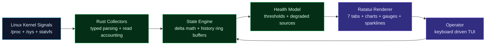

# fedora-monitor

<p align="center">
  
</p>

<p align="center">
  
</p>

<p align="center">
  <a href="https://github.com/digitalninjanv"></a>
  
  
  
  <a href="https://github.com/digitalninjanv/fedora-system-monitor/releases"></a>
  <a href="https://github.com/digitalninjanv/fedora-system-monitor/actions/workflows/release.yml"></a>
</p>

<p align="center">
  <a href="#english">English</a>
  ·
  <a href="#indonesia">Indonesia</a>
  ·
  <a href="#installation">Install</a>
  ·
  <a href="#features">Features</a>
  ·
  <a href="#tabs">Tabs</a>
  ·
  <a href="#configuration">Configuration</a>
  ·
  <a href="#cli">CLI</a>
  ·
  <a href="#keyboard">Keyboard</a>
  ·
  <a href="#architecture">Architecture</a>
</p>

---

## English

`fedora-monitor` is a **modular terminal system monitor** for Fedora/Linux built with Rust, Ratatui, and Crossterm. It reads native Linux metrics directly from `/proc`, `/sys`, and `statvfs`, renders a **7-tab real-time TUI** with GPU monitoring, and keeps every sample accountable with `OK`, `Partial`, or `Degraded` status.

Design principles:
- **No daemon** — runs in your terminal, nothing runs in the background
- **No database** — no SQLite, no time-series DB, no logs
- **No telemetry** — zero network calls, data never leaves your machine
- **No shelling out** — no `df`, no `ps`, no `top`; pure kernel reads
- **Accountability-first** — every collector reports success or failure per tick

The binary is ~1.2 MB (release) with a configurable TOML config file, keyboard-driven navigation, and panic-safe terminal recovery.

## Installation

### Option 1: One-liner (recommended)

```bash
curl -sSfL https://github.com/digitalninjanv/fedora-system-monitor/releases/latest/download/install.sh | sh
```

This downloads the prebuilt binary for your architecture and installs it to `~/.local/bin/`.

### Option 2: GitHub Releases

Download the latest binary from the [Releases page](https://github.com/digitalninjanv/fedora-system-monitor/releases):

```bash
# x86_64
curl -sSfL https://github.com/digitalninjanv/fedora-system-monitor/releases/latest/download/fedora-monitor-x86_64-unknown-linux-gnu.tar.gz | tar -xz
sudo install fedora-monitor /usr/local/bin/

# aarch64
curl -sSfL https://github.com/digitalninjanv/fedora-system-monitor/releases/latest/download/fedora-monitor-aarch64-unknown-linux-gnu.tar.gz | tar -xz
sudo install fedora-monitor /usr/local/bin/
```

### Option 3: Cargo (requires Rust toolchain)

```bash
cargo install fedora-monitor
```

### Option 4: Build from source

```bash
git clone https://github.com/digitalninjanv/fedora-system-monitor.git
cd fedora-system-monitor
cargo build --release
./target/release/fedora-monitor
```

## Indonesia

`fedora-monitor` adalah **dashboard terminal modular** untuk Fedora/Linux yang dibuat dengan Rust, Ratatui, dan Crossterm. Aplikasi membaca metrik Linux langsung dari `/proc`, `/sys`, dan `statvfs`, menampilkan **TUI 7 tab real-time** termasuk monitoring GPU, dan memberi status kualitas sampel: `OK`, `Partial`, atau `Degraded`.

Prinsip desain:
- **Tanpa daemon** — berjalan di terminal, tidak ada proses latar
- **Tanpa database** — tidak pakai SQLite, time-series DB, atau log
- **Tanpa telemetri** — nol panggilan jaringan, data tidak pernah keluar
- **Tanpa shelling out** — tidak pakai `df`, `ps`, atau `top`
- **Akuntabilitas** — setiap kolektor melaporkan sukses/gagal per tick

Binary ~1.2 MB (release), konfigurasi via TOML, navigasi keyboard, dan panic-safe terminal recovery.

### Instalasi

**Pilihan 1: Satu baris (recommended)**
```bash
curl -sSfL https://github.com/digitalninjanv/fedora-system-monitor/releases/latest/download/install.sh | sh
```
Otomatis download binary yang cocok dengan arsitektur kamu dan pasang ke `~/.local/bin/`.

**Pilihan 2: Cargo (butuh Rust)**
```bash
cargo install fedora-monitor
```

**Pilihan 3: Build dari source**
```bash
git clone https://github.com/digitalninjanv/fedora-system-monitor.git
cd fedora-system-monitor
cargo build --release
./target/release/fedora-monitor
```

---

## Features

- **7 interactive tabs** — Overview, CPU, GPU, Memory, Storage, Network, Processes
- **GPU** — per-GPU tables with vendor/model/driver, temperature, usage %, power draw, frequency, VRAM, RC6 residency
- **CPU** — total usage, per-core peak, load average, delta-based trend chart (120s)
- **Memory** — RAM + swap usage percentage, live pressure, trend chart
- **Disk/Storage** — usage per mount point, **disk I/O throughput** from `/proc/diskstats`
- **Network** — per-interface RX/TX rates, total bandwidth summary
- **Processes** — sortable columns (CPU/MEM/PID asc/desc), **inline sparkline** CPU history per process, **high-risk detection** (>90% CPU), search, kill
- **Health score** — penalty-based scoring (CPU/RAM/disk/swap/temperature thresholds)
- **Threshold alerts** — configurable per-metric, with **high-risk process alerts**
- **Sample accountability** — every read tracked: `OK` / `Partial` / `Degraded`
- **Config file** — `~/.config/fedora-monitor/config.toml`
- **JSON output** — single-shot snapshot via `--json` / `--json-pretty`
- **Panic guard** — restores terminal before rethrowing on crash
- **Rate-limited resize** — skips sample ticks during terminal resize

---

## Tabs

| # | Tab | Content |
|---|-----|---------|
| 1 | **Overview** | 5 KPI cards (CPU, Memory, Swap, Disk, Network), history charts (CPU + Memory), resource pressure gauges, live alerts |
| 2 | **CPU** | CPU info + load average, per-core usage bars (responsive height), 120s trend chart with area fill |
| 3 | **GPU** | Per-GPU tables: vendor/model/driver, temperature, usage %, power draw, frequency, VRAM, RC6 residency |
| 4 | **Memory** | RAM + swap gauges, detailed numeric breakdown, temperature, trend chart |
| 5 | **Storage** | `/` usage gauge, disk I/O table (device read/write throughput), mount point table |
| 6 | **Network** | Total down/up summary, per-interface RX/TX rates |
| 7 | **Processes** | Process count + active sort label, sorted process table with PID, CPU%, MEM, command, sparkline, and high-risk indicators. Search (`/`) and kill (`K`) support |

### Process Sort Orders

Press `S` to cycle through sort modes:

| Mode | Sort |
|------|------|
| CPU ↓ | CPU descending (highest first) |
| CPU ↑ | CPU ascending |
| MEM ↓ | Memory descending |
| MEM ↑ | Memory ascending |
| PID ↑ | PID ascending |
| PID ↓ | PID descending |

---

## Signal Grid

| Layer | Signal | Source | Granularity |
|-------|--------|--------|-------------|
| Compute | CPU total, per-core, load 1/5/15m | `/proc/stat`, `/proc/loadavg` | Per-tick delta |
| Memory | RAM used/total, swap used/total | `/proc/meminfo` (MemAvailable) | Instant read |
| Storage | Mount usage, mount list | `/proc/mounts` + `statvfs` | Instant read |
| Disk I/O | Per-device read/write throughput | `/proc/diskstats` | Delta-based |
| Network | Per-interface RX/TX bytes | `/proc/net/dev` | Delta-based |
| GPU | Vendor, model, temp, usage, power, freq, VRAM, RC6 | `/sys/class/drm` + `/sys/class/hwmon` | Instant read |
| Processes | Top CPU/MEM, count, per-process sparkline | `/proc/<pid>/stat`, `/proc/<pid>/status` | Delta CPU, instant MEM |
| Battery | Capacity %, charging status | `/sys/class/power_supply` | Every 5 ticks |
| Thermal | Temperature in °C | `/sys/class/thermal` | Every 3 ticks |
| Platform | OS, kernel, hostname, CPU model | `/etc/os-release`, `/proc/sys/kernel/*`, `/proc/cpuinfo` | Once at startup |

---

## Configuration

Create `~/.config/fedora-monitor/config.toml`:

```toml
# Refresh interval: 500ms, 750ms, 1s, 2s, 5s
refresh_interval = "1s"

# Default tab: overview, cpu, gpu, memory, storage, network, processes
default_tab = "overview"

# Alert thresholds (optional, defaults shown)
cpu_alert    = 85.0    # CPU usage % threshold
mem_alert    = 85.0    # Memory usage % threshold
disk_alert   = 85      # Disk usage % threshold
temp_alert   = 80.0    # Temperature °C threshold
battery_alert = 20     # Battery % threshold
swap_alert   = 35.0    # Swap usage % threshold
```

All fields are optional. Missing fields use built-in defaults. CLI `--interval` overrides the config file value.

---

## CLI

```bash
fedora-monitor                 # Start with defaults or config
fedora-monitor --help          # Show help
fedora-monitor --version       # Show version
fedora-monitor -i 1s           # Start with 1s refresh
fedora-monitor --interval=500ms # Start with 500ms refresh
fedora-monitor --json          # Single-shot JSON snapshot to stdout
fedora-monitor --json-pretty   # Single-shot pretty-printed JSON
```

### Supported intervals

| Interval | Use case |
|----------|----------|
| `500ms`  | Fast local inspection |
| `750ms`  | Responsive default-style monitoring |
| `1s`     | Balanced terminal usage |
| `2s`     | Lower refresh pressure |
| `5s`     | Quiet long-running watch |

---

## Keyboard

| Key | Action |
|-----|--------|
| `Q` / `Esc` | Exit |
| `R` | Refresh immediately |
| `H` | Toggle help panel |
| `1`-`7` | Switch tab |
| `Tab` | Next tab |
| `Shift+Tab` | Previous tab |
| `S` | Cycle process sort order |
| `K` | Kill selected process (press again to confirm) |
| `/` | Search/filter processes |
| `↑` / `↓` | Navigate process list |
| `+` / `=` | Faster refresh interval |
| `-` / `_` | Slower refresh interval |

---

## Architecture

```
src/
├── main.rs         # Entry point, CLI parsing, config loading, panic guard
├── types.rs        # Data structures, AppState, health model, alerts
├── collector.rs    # Raw metric readers (/proc, /sys, statvfs)
├── state.rs        # State engine: update, delta math, history, health, alerts
└── ui/
    ├── mod.rs      # TUI module root, event loop, keyboard handler, tab renderer
    ├── theme.rs    # Catppuccin Mocha color theme
    ├── common.rs   # Shared UI utilities (panels, formatting, layout helpers)
    ├── header.rs   # Top bar: hostname, OS, health score, battery, load avg
    ├── footer.rs   # Bottom bar: shortcuts, refresh rate, network rates
    ├── help.rs     # Help modal overlay
    ├── overview.rs # Overview tab: 5 KPI cards, charts, alerts
    ├── cpu.rs      # CPU tab: per-core bars, load avg, trend chart
    ├── gpu.rs      # GPU tab: per-GPU tables (temp, usage, power, freq, VRAM)
    ├── memory.rs   # Memory tab: RAM + swap gauges, breakdown, trend
    ├── storage.rs  # Storage tab: root gauge, mount table, disk I/O
    ├── network.rs  # Network tab: total rates, per-interface table
    └── processes.rs # Processes tab: sortable table, sparkline, search, kill
```



### Data flow per tick

1. **Collect** — all collectors run in sequence; each returns `Option<T>` (success) or `None` (failure)
2. **Account** — `capture()` increments `successful_reads` or `failed_reads` + `degraded_sources`
3. **Compute** — CPU/network/disk-I/O deltas, process CPU normalization, trend history push
4. **Evaluate** — health score, threshold alerts, process high-risk markers, sparkline update
5. **Render** — terminal draws the current tab: charts, gauges, tables, alerts

Lazy reads: battery every 5 ticks, thermal every 3 ticks. System info read once.

---

## Sample System

| Status | Meaning |
|--------|---------|
| `OK` | All tracked sample sources were read successfully |
| `Partial` | One or two tracked sources failed in the latest sample |
| `Degraded` | More than two tracked sources failed in the latest sample |

CPU and process percentages are delta-based. The first sample shows zero values until the second sample is collected. Process CPU percentage is normalized against total CPU jiffies across all cores.

---

## Accuracy Notes

- **CPU**: reads `/proc/stat` fields 3 (idle) + 4 (iowait) as idle. Delta over refresh interval.
- **Memory**: uses `MemAvailable` for used calculation, not `MemFree`. More accurate for real available memory.
- **Process CPU**: `utime + stime` from `/proc/<pid>/stat`, normalized against total CPU delta. First tick is always 0%.
- **Disk I/O**: sector count * 512 bytes. Delta over refresh interval. Filters out loop/dm-/ram devices.
- **Network**: byte counters from `/proc/net/dev`. Skips loopback. Delta over refresh interval.
- **GPU**: reads from `/sys/class/drm` for device info and `/sys/class/hwmon` for temperature/power. RC6 from debugfs.
- **Battery/Thermal**: read every 5/3 ticks respectively to reduce I/O pressure.

---

## Development

```bash
cargo fmt
cargo test          # 30+ unit tests
cargo clippy -- -D warnings
cargo build --release
```

### Add a new metric

1. Add struct to `types.rs`
2. Add `read_*` function to `collector.rs`
3. Add field + update logic in `state.rs` (AppState::update)
4. Add rendering in `ui/<tab>.rs` (or add a new tab in `ui/mod.rs`)

---

## Binary

```
fat binary: ~1.2 MB (release, with serde/toml/json for config and JSON output)
strip:      symbols stripped in release profile
LTO:        thin
opt-level:  3
codegen-units: 1
targets:    x86_64-unknown-linux-gnu, aarch64-unknown-linux-gnu
```

---

## License

MIT
