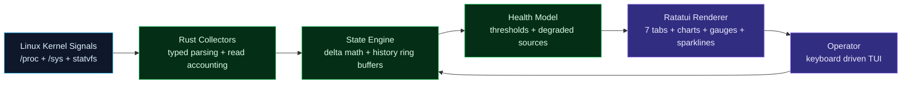

# fedora-monitor

<p align="center">
  
</p>

<p align="center">
  
</p>

<p align="center">
  <a href="https://github.com/digitalninjanv"></a>
  
  
  
  <a href="https://github.com/digitalninjanv/fedora-system-monitor/releases"></a>
  <a href="https://github.com/digitalninjanv/fedora-system-monitor/actions/workflows/release.yml"></a>
</p>

<p align="center">
  <a href="#english">English</a>
  ·
  <a href="#indonesia">Indonesia</a>
  ·
  <a href="#quick-start">Quick Start</a>
  ·
  <a href="#usage">Usage</a>
  ·
  <a href="#tabs">Tabs</a>
  ·
  <a href="#cli-reference">CLI</a>
  ·
  <a href="#configuration">Config</a>
  ·
  <a href="#keyboard-shortcuts">Keys</a>
  ·
  <a href="#architecture">Architecture</a>
</p>

---

## English

`fedora-monitor` is a **modular terminal system monitor** for Fedora/Linux built with Rust, Ratatui, and Crossterm. It reads native Linux metrics directly from `/proc`, `/sys`, and `statvfs`, renders a **7-tab real-time TUI** with GPU monitoring, and keeps every sample accountable with `OK`, `Partial`, or `Degraded` status.

### Design Principles

- **No daemon** — runs in your terminal, nothing runs in the background
- **No database** — no SQLite, no time-series DB, no logs
- **No telemetry** — zero network calls, data never leaves your machine
- **No shelling out** — no `df`, no `ps`, no `top`; pure kernel reads
- **Accountability-first** — every collector reports success or failure per tick

The binary is ~1.2 MB (release) with a configurable TOML config file, keyboard-driven navigation, and panic-safe terminal recovery.

---

## Indonesia

`fedora-monitor` adalah **dashboard terminal modular** untuk Fedora/Linux yang dibuat dengan Rust, Ratatui, dan Crossterm. Membaca metrik Linux langsung dari `/proc`, `/sys`, dan `statvfs`, menampilkan **TUI 7 tab real-time** termasuk monitoring GPU, dan memberi status kualitas sampel: `OK`, `Partial`, atau `Degraded`.

### Prinsip Desain

- **Tanpa daemon** — berjalan di terminal, tidak ada proses latar
- **Tanpa database** — tidak pakai SQLite, time-series DB, atau log
- **Tanpa telemetri** — nol panggilan jaringan, data tidak pernah keluar
- **Tanpa shelling out** — tidak pakai `df`, `ps`, atau `top`
- **Akuntabilitas** — setiap kolektor melaporkan sukses/gagal per tick

Binary ~1.2 MB (release), konfigurasi via TOML, navigasi keyboard, dan panic-safe terminal recovery.

---

## Quick Start

### Install

```bash
curl -sSfL https://github.com/digitalninjanv/fedora-system-monitor/releases/latest/download/install.sh | sh
```

### Run

```bash
fedora-monitor
```

Press `Q` to quit. See [Installation](#installation) for all methods.

---

## Installation

### One-liner (recommended)

```bash
curl -sSfL https://github.com/digitalninjanv/fedora-system-monitor/releases/latest/download/install.sh | sh
```

Automatically detects your CPU architecture (x86_64 or aarch64), downloads the matching prebuilt binary, and installs it to `~/.local/bin/`.

### GitHub Releases

Download from the [Releases page](https://github.com/digitalninjanv/fedora-system-monitor/releases):

```bash
# x86_64
curl -sSfL https://github.com/digitalninjanv/fedora-system-monitor/releases/latest/download/fedora-monitor-v0.1.0-x86_64-unknown-linux-gnu.tar.gz | tar -xz
sudo install fedora-monitor /usr/local/bin/

# aarch64
curl -sSfL https://github.com/digitalninjanv/fedora-system-monitor/releases/latest/download/fedora-monitor-v0.1.0-aarch64-unknown-linux-gnu.tar.gz | tar -xz
sudo install fedora-monitor /usr/local/bin/
```

### Cargo (requires Rust toolchain)

```bash
cargo install fedora-monitor
```

### Build from source

```bash
git clone https://github.com/digitalninjanv/fedora-system-monitor.git
cd fedora-system-monitor
cargo build --release
./target/release/fedora-monitor
```

### Uninstall

To completely remove `fedora-monitor` from your system, delete the binary and configuration files:

```bash
# Remove the binary (check whichever path you installed it to)
rm -f ~/.local/bin/fedora-monitor
sudo rm -f /usr/local/bin/fedora-monitor

# (Optional) Remove the configuration directory
rm -rf ~/.config/fedora-monitor
```

### Instalasi (Indonesia)

**Pilihan 1: Satu baris (recommended)**
```bash
curl -sSfL https://github.com/digitalninjanv/fedora-system-monitor/releases/latest/download/install.sh | sh
```
Otomatis download binary yang cocok dengan arsitektur kamu dan pasang ke `~/.local/bin/`.

**Pilihan 2: Cargo (butuh Rust)**
```bash
cargo install fedora-monitor
```

**Pilihan 3: Build dari source**
```bash
git clone https://github.com/digitalninjanv/fedora-system-monitor.git
cd fedora-system-monitor
cargo build --release
./target/release/fedora-monitor
```

**Pilihan 4: Uninstall**

Untuk menghapus `fedora-monitor` sepenuhnya dari sistem Anda, jalankan perintah berikut:

```bash
# Hapus binary (sesuaikan dengan lokasi instalasi Anda)
rm -f ~/.local/bin/fedora-monitor
sudo rm -f /usr/local/bin/fedora-monitor

# (Opsional) Hapus direktori konfigurasi
rm -rf ~/.config/fedora-monitor
```

---

## Usage

### Basic usage

```bash
fedora-monitor                      # Start with default settings
fedora-monitor -i 500ms             # Start with 500ms refresh rate
fedora-monitor --interval=2s        # Start with 2s refresh rate
fedora-monitor --json               # Print system snapshot as JSON, then exit
fedora-monitor --json-pretty        # Print pretty-printed JSON snapshot, then exit
fedora-monitor --help               # Show help
fedora-monitor --version            # Show version
```

### Quick keys while running

| Key | Action |
|-----|--------|
| `1`-`7` | Switch to a specific tab |
| `Q` / `Esc` | Exit |
| `R` | Force refresh all metrics now |
| `H` | Toggle help panel overlay |
| `+` / `=` | Increase refresh rate (faster) |
| `-` / `_` | Decrease refresh rate (slower) |

### Process tab controls

| Key | Action |
|-----|--------|
| `S` | Cycle sort order (CPU↓, CPU↑, MEM↓, MEM↑, PID↑, PID↓) |
| `↑` / `↓` | Navigate process list selection |
| `K` | Kill selected process (press again to confirm) |
| `/` | Enter search/filter mode |

---

## Tabs

### Tab 1: Overview

The default tab showing a high-level system health dashboard.

| Element | Description |
|---------|-------------|
| **KPI Cards** | 5 metric cards showing CPU, Memory, Swap, Disk, and Network usage percentages |
| **History Charts** | 120-second line charts for CPU and Memory with area fill |
| **Pressure Gauges** | Visual indicator bars for resource pressure |
| **Live Alerts** | Real-time threshold-based alerts (CPU, memory, disk, temperature, battery) |
| **Health Score** | Overall system health score (0-100) in the top bar |

### Tab 2: CPU

Detailed per-core CPU monitoring.

| Element | Description |
|---------|-------------|
| **CPU Info** | Model name, architecture |
| **Load Average** | 1, 5, and 15-minute load averages |
| **Per-core Bars** | Usage percentage for each logical core, responsive height |
| **Total Usage** | Aggregated CPU usage percentage |
| **Trend Chart** | 120-second history line chart with area fill |

### Tab 3: GPU

Per-GPU monitoring for AMD, Intel, and NVIDIA GPUs.

| Element | Description |
|---------|-------------|
| **GPU Summary** | Vendor, model, driver version for each GPU |
| **Temperature** | Current GPU temperature in °C |
| **Usage** | GPU core utilization percentage |
| **Power Draw** | Current power consumption in watts |
| **Frequency** | Current core clock frequency |
| **VRAM** | Used and total video memory |
| **RC6 Residency** | Intel GPU RC6 sleep state residency |

### Tab 4: Memory

RAM and swap usage overview.

| Element | Description |
|---------|-------------|
| **RAM Gauge** | Visual gauge with used/total and percentage |
| **Swap Gauge** | Visual gauge with used/total and percentage |
| **Detailed Breakdown** | MemTotal, MemAvailable, Buffers, Cached, SwapTotal, SwapFree |
| **Temperature** | Current system temperature |
| **Trend Chart** | 120-second memory usage history |

### Tab 5: Storage

Disk usage and I/O monitoring.

| Element | Description |
|---------|-------------|
| **Root Usage Gauge** | `/` filesystem usage with used/total |
| **Mount Point Table** | List of all mounted filesystems with usage % |
| **Disk I/O Table** | Per-device read/write throughput in KB/s or MB/s (delta-based) |

### Tab 6: Network

Network interface bandwidth monitoring.

| Element | Description |
|---------|-------------|
| **Total Bandwidth** | Aggregated download (RX) and upload (TX) rates across all interfaces |
| **Per-interface Table** | Each interface with RX rate, TX rate, and total |

### Tab 7: Processes

Interactive process management.

| Element | Description |
|---------|-------------|
| **Process Table** | PID, CPU%, MEM%, Command |
| **Sparkline** | Inline 30-tick CPU history chart per process |
| **Sort Modes** | Cycle via `S`: CPU↓, CPU↑, MEM↓, MEM↑, PID↑, PID↓ |
| **High-risk Detection** | Processes exceeding 90% CPU marked with warning |
| **Search** | Press `/` to filter processes by name |
| **Kill** | Select process with `↑`/`↓`, press `K` twice to send SIGKILL |

---

## CLI Reference

### Options

| Flag | Description |
|------|-------------|
| `-h`, `--help` | Print help information and exit |
| `-V`, `--version` | Print version number and exit |
| `-i <value>`, `--interval <value>` | Set refresh interval. Supported: `500ms`, `750ms`, `1s`, `2s`, `5s` |
| `--interval=<value>` | Alternative syntax for setting interval |
| `--json` | Print single-shot JSON snapshot to stdout and exit |
| `--json-pretty` | Print single-shot pretty-printed JSON snapshot to stdout and exit |

### Supported refresh intervals

| Interval | Use case |
|----------|----------|
| `500ms` | Fast local inspection, responsive monitoring |
| `750ms` | Balanced default-style monitoring |
| `1s` | General-purpose monitoring |
| `2s` | Lower I/O pressure, longer sessions |
| `5s` | Quiet long-running watch in the background |

### JSON output

The `--json` and `--json-pretty` flags output a complete system snapshot as JSON:

```bash
fedora-monitor --json-pretty
```

Example output structure:

```json
{
  "timestamp": "2026-06-20T03:51:52Z",
  "cpu": { "usage_pct": 23.5, "load_1m": 1.2, "load_5m": 0.8, "load_15m": 0.6 },
  "memory": { "total_kb": 16384000, "available_kb": 8192000, "swap_total_kb": 8388608, "swap_free_kb": 7340032 },
  "disk": { "root_used_pct": 45 },
  "network": { "total_rx": 1250000, "total_tx": 450000 },
  "gpu": [ { "vendor": "AMD", "model": "...", "temp_c": 52.0, "usage_pct": 15.0 } ],
  "processes": [ { "pid": 1234, "cpu": 5.2, "mem": 2.1, "command": "firefox" } ],
  "health_score": 92,
  "sample_status": "OK"
}
```

---

## Configuration

Create a TOML config file at `~/.config/fedora-monitor/config.toml`:

```toml
# --- Refresh interval ---
# Supported: 500ms, 750ms, 1s, 2s, 5s
# CLI --interval overrides this value
refresh_interval = "1s"

# --- Default tab on startup ---
# Options: overview, cpu, gpu, memory, storage, network, processes
default_tab = "overview"

# --- Alert thresholds ---
# When a metric exceeds its threshold, an alert appears in the Overview tab.
# All fields are optional. Defaults are shown below.
cpu_alert     = 85.0    # CPU usage % (float)
mem_alert     = 85.0    # Memory usage % (float)
disk_alert    = 85      # Disk usage % (integer)
temp_alert    = 80.0    # Temperature in °C (float)
battery_alert = 20      # Battery capacity % (integer)
swap_alert    = 35.0    # Swap usage % (float)
```

All fields are optional. Any missing fields use built-in defaults.

---

## Keyboard Shortcuts

### General

| Key | Action |
|-----|--------|
| `Q` / `Esc` | Exit the application |
| `R` | Force refresh all metrics immediately |
| `H` | Toggle help panel overlay |
| `1` | Switch to Overview tab |
| `2` | Switch to CPU tab |
| `3` | Switch to GPU tab |
| `4` | Switch to Memory tab |
| `5` | Switch to Storage tab |
| `6` | Switch to Network tab |
| `7` | Switch to Processes tab |
| `Tab` | Next tab |
| `Shift+Tab` | Previous tab |

### Refresh rate

| Key | Action |
|-----|--------|
| `+` / `=` | Increase refresh rate (cycle to next faster interval) |
| `-` / `_` | Decrease refresh rate (cycle to next slower interval) |

### Process tab

| Key | Action |
|-----|--------|
| `S` | Cycle sort order: CPU↓ → CPU↑ → MEM↓ → MEM↑ → PID↑ → PID↓ |
| `↑` | Move selection up in process list |
| `↓` | Move selection down in process list |
| `K` | Kill selected process (first press marks, second confirms with SIGKILL) |
| `/` | Enter search mode; type to filter processes by name; `Esc` to exit |

---

## Architecture

### Project structure

```
src/
├── main.rs         # Entry point, CLI parsing, config loading, panic guard
├── types.rs        # Data structures, AppState, health model, alerts, config types
├── collector.rs    # Raw metric readers (/proc/stat, /proc/meminfo, /proc/diskstats, etc.)
├── state.rs        # State engine: update, delta math, history ring buffers, health, alerts
└── ui/
    ├── mod.rs      # TUI module root, event loop, keyboard handler, tab dispatch
    ├── theme.rs    # Catppuccin Mocha color theme
    ├── common.rs   # Shared UI utilities (panel blocks, formatting, layout helpers)
    ├── header.rs   # Top bar: hostname, OS, kernel, health score, battery, load avg
    ├── footer.rs   # Bottom bar: keyboard shortcuts, refresh rate, network rates
    ├── help.rs     # Help modal overlay
    ├── overview.rs # Overview tab: 5 KPI cards, history charts, alerts
    ├── cpu.rs      # CPU tab: per-core bars, load avg, trend chart
    ├── gpu.rs      # GPU tab: vendor/model, temp, usage, power, freq, VRAM
    ├── memory.rs   # Memory tab: RAM + swap gauges, breakdown, trend
    ├── storage.rs  # Storage tab: root gauge, mount table, disk I/O
    ├── network.rs  # Network tab: total rates, per-interface table
    └── processes.rs # Processes tab: sortable table, sparkline, search, kill
```

### Data flow



### Per-tick data flow

1. **Collect** — all collectors run in sequence; each returns `Option<T>` (success) or `None` (failure)
2. **Account** — `capture()` increments `successful_reads` or `failed_reads` + `degraded_sources`
3. **Compute** — CPU/network/disk-I/O deltas, process CPU normalization, trend history push
4. **Evaluate** — health score calculation, threshold alerts, process high-risk markers, sparkline update
5. **Render** — terminal draws the current tab: charts, gauges, tables, alerts

Lazy reads: battery every 5 ticks, thermal every 3 ticks. System info read once at startup.

---

## Signal Sources

| Layer | Signal | Source | Granularity |
|-------|--------|--------|-------------|
| Compute | CPU total, per-core, load 1/5/15m | `/proc/stat`, `/proc/loadavg` | Per-tick delta |
| Memory | RAM used/total, swap used/total | `/proc/meminfo` (MemAvailable) | Instant read |
| Storage | Mount usage, mount list | `/proc/mounts` + `statvfs` | Instant read |
| Disk I/O | Per-device read/write throughput | `/proc/diskstats` | Delta-based |
| Network | Per-interface RX/TX bytes | `/proc/net/dev` | Delta-based |
| GPU | Vendor, model, temp, usage, power, freq, VRAM, RC6 | `/sys/class/drm` + `/sys/class/hwmon` | Instant read |
| Processes | Top CPU/MEM, count, per-process sparkline | `/proc/<pid>/stat`, `/proc/<pid>/status` | Delta CPU, instant MEM |
| Battery | Capacity %, charging status | `/sys/class/power_supply` | Every 5 ticks |
| Thermal | Temperature in °C | `/sys/class/thermal` | Every 3 ticks |
| Platform | OS, kernel, hostname, CPU model | `/etc/os-release`, `/proc/sys/kernel/*`, `/proc/cpuinfo` | Once at startup |

---

## Sample Accountability System

Every tick, each metric collector reports its status. The application tracks and displays the overall sample quality:

| Status | Meaning |
|--------|---------|
| `OK` | All tracked sample sources were read successfully |
| `Partial` | One or two tracked sources failed in the latest sample |
| `Degraded` | More than two tracked sources failed in the latest sample |

The sample status is displayed in the header bar next to the health score.

CPU and process percentages are delta-based — the first sample shows zero values until the second sample is collected. Process CPU percentage is normalized against total CPU jiffies across all cores.

### Health Score

The health score (0-100) is calculated using a penalty-based system:
- Starts at 100
- Each exceeded threshold (CPU, memory, disk, swap, temperature) applies a penalty
- More severe violations result in larger penalties
- The score is displayed in the header bar

---

## Accuracy Notes

- **CPU**: reads `/proc/stat` fields 3 (idle) + 4 (iowait) as idle. Delta over refresh interval.
- **Memory**: uses `MemAvailable` for used calculation (`MemTotal - MemAvailable`), not `MemFree`. This accounts for cached and buffered memory that is reclaimable, giving a more accurate picture of actual available memory.
- **Process CPU**: `utime + stime` from `/proc/<pid>/stat`, normalized against total CPU delta. The first tick always shows 0% since no delta exists yet.
- **Disk I/O**: sector count * 512 bytes. Delta over refresh interval. Filters out loop, dm-*, and ram devices.
- **Network**: byte counters from `/proc/net/dev`. Skips loopback interface. Delta over refresh interval.
- **GPU**: reads from `/sys/class/drm` for device information and `/sys/class/hwmon` for temperature/power metrics. RC6 residency from debugfs.
- **Battery/Thermal**: read every 5/3 ticks respectively to reduce I/O pressure on `/sys`.

---

## Development

### Prerequisites

- Rust toolchain (install via [rustup](https://rustup.rs/))
- Linux system with `/proc` and `/sys` (Fedora recommended, works on any Linux)

### Commands

```bash
cargo fmt                  # Format code
cargo test                 # Run unit tests (30+ tests)
cargo clippy -- -D warnings # Lint
cargo build --release      # Build optimized binary
```

### Adding a new metric

1. Define the data struct in `src/types.rs`
2. Implement the reader function in `src/collector.rs`
3. Add update logic in `src/state.rs` (`AppState::update`)
4. Render the data in the appropriate `src/ui/<tab>.rs` file (or add a new tab in `src/ui/mod.rs`)

### Release process

```bash
# Create a new release
git tag v0.2.0
git push origin v0.2.0
```

GitHub Actions automatically builds binaries for x86_64 and aarch64, creates a GitHub Release, and uploads the archives.

---

## Binary specs

```
Size:       ~1.2 MB (stripped release build)
Strip:      symbols stripped in release profile
LTO:        thin
opt-level:  3
codegen-units: 1
Targets:    x86_64-unknown-linux-gnu, aarch64-unknown-linux-gnu
Dependencies: libc (via statvfs/sysconf), no external runtime
```

---

## License

MIT
